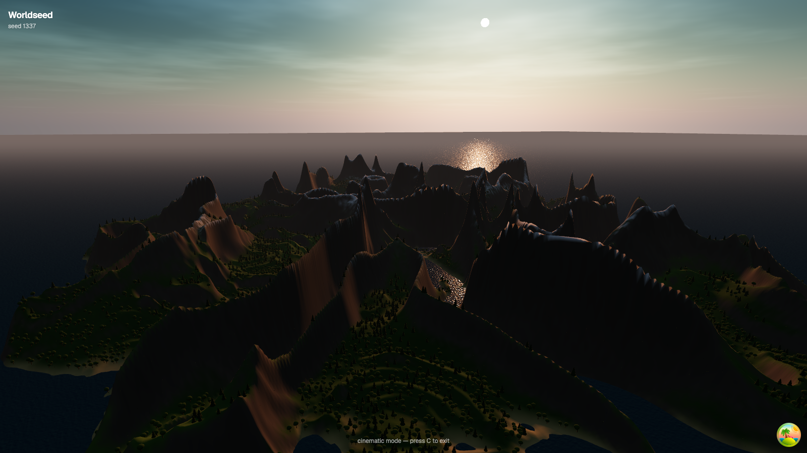
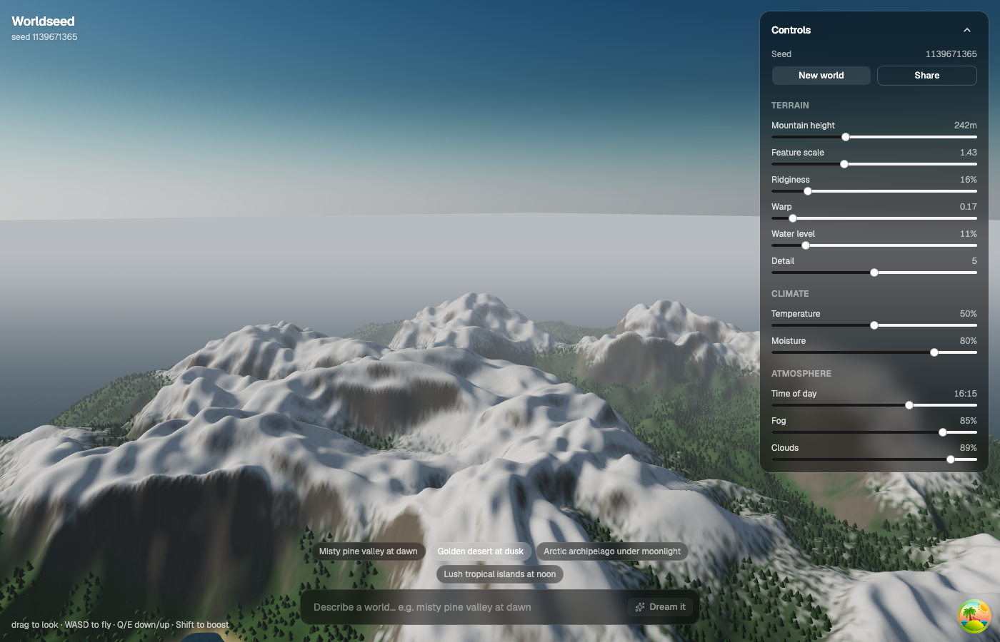
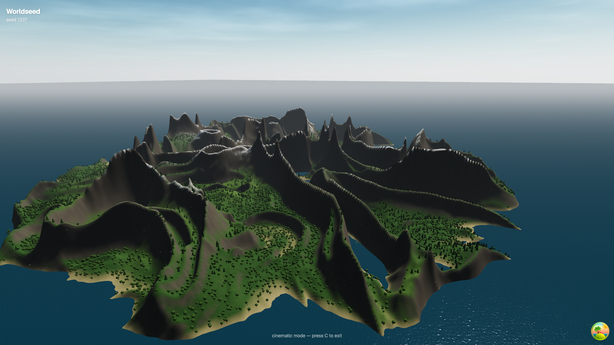
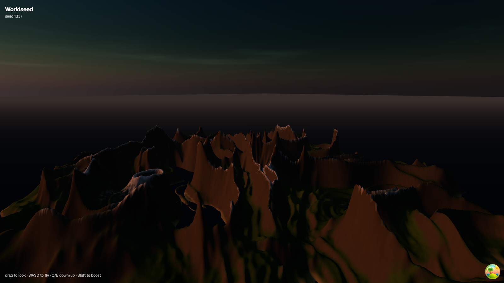
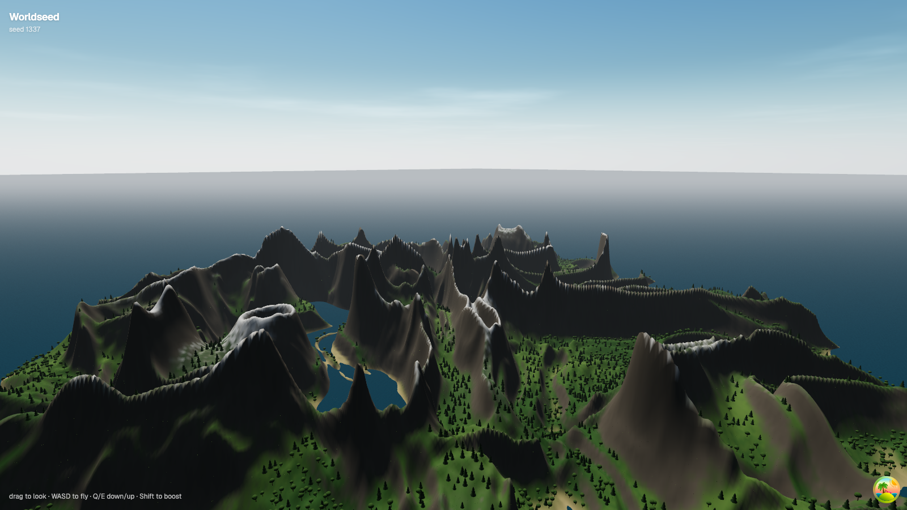
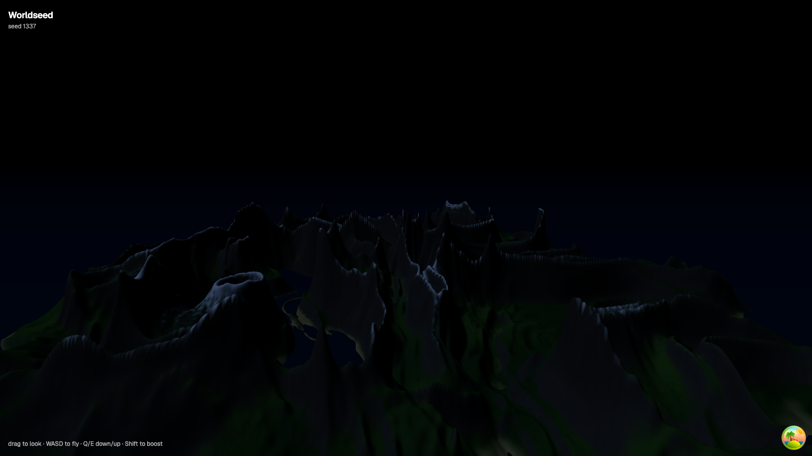

# 🌍 Worldseed

**Describe a world in plain English. Watch it form.**

Worldseed is a procedurally generated 3D world that runs in your browser —
every mountain, tree, ripple and cloud is generated by code from a single
seed. No 3D assets, no textures, no models. Type *"misty pine valley at
dawn"* and an LLM translates it into engine parameters; the world rebuilds in
front of you.



## How it works

```
 ┌──────────────────────────── Browser ─────────────────────────────┐
 │                                                                  │
 │  React UI  ──── WorldParams ────▶  three.js WebGPU engine        │
 │  (controls, prompt bar)            (terrain · biomes · sky ·     │
 │        │                            vegetation · water · wind)   │
 └────────│─────────────────────────────────────────────────────────┘
          │  POST /generate {"prompt": "…"}
          ▼
   AWS Lambda ──▶ OpenAI API (strict structured outputs → validated JSON)
```

Everything hinges on one typed object — `WorldParams` (seed, terrain shape,
climate, atmosphere). Sliders edit it by hand; the AI fills it from language;
the URL encodes it, so **every world is a shareable link**. The LLM never
touches rendering — it's a control plane over a deterministic engine, with all
output schema-constrained and clamped.



## Highlights

| | |
|---|---|
|  |  |
| Whittaker biomes: temperature × moisture drive forest, meadow, tundra, desert, snowline | One `timeOfDay` number drives sun, sky scattering, fog color, and golden-hour grading |
|  |  |
| ~30k instanced procedural trees + grass, placed by climate, swaying in GPU wind | Moonlit nights — the light rig swaps to a moon below −5° sun elevation |

- **Terrain** — domain-warped fBm + ridged multifractals on a 512² heightfield, radial falloff, valley-flattening curve
- **Atmosphere** — physical sky (Rayleigh/Mie via three.js TSL), procedural clouds, exponential height fog, ACES tone mapping
- **Vegetation** — species picked by climate, per-instance wind phase, all geometry built from primitives at runtime
- **Water** — a generated tileable ripple normal map (simplex noise on a torus), scrolled per-frame
- **Deterministic** — same seed, same world, on any machine (`?seed=1337`)
- **AI layer** — GPT-4o mini with strict structured outputs → zod-validated, range-clamped `WorldParams`; free mock mode for local dev
- **Cinematic mode** — press `C` for a slow, non-repeating drone flight path (what the demo video was recorded with)
- **Ships everywhere** — WebGPU with automatic WebGL2 fallback; High/Medium/Low quality presets auto-detected per device (pixel ratio, terrain resolution, vegetation density) and switchable live

## Run it locally

```sh
nvm use                      # Node 22
npm install
npm run dev                  # 1. frontend → http://localhost:5173

node lambda/dev-server.mjs   # 2. AI API on :8787 (separate terminal)
```

With no key the AI API runs in **mock mode** — free, deterministic, no
account needed. For real AI generations:

```sh
cp lambda/.env.example lambda/.env   # then put your OpenAI key in lambda/.env
node lambda/dev-server.mjs           # now prints "live mode"
```

Deploying to AWS: see [lambda/README.md](lambda/README.md).

**Controls** — drag to look · WASD fly · Q/E down/up · Shift boost · `C` cinematic mode

## Stack

TypeScript (strict) · three.js `WebGPURenderer` + TSL · React 19 · Tailwind v4 ·
shadcn/ui · TanStack Query · zod · Vite · AWS Lambda · OpenAI API

## Built with AI, deliberately

This project was built in collaboration with Claude (Fable 5) using a
lead/implementer agent workflow: a lead session owned architecture, specs, and
code review; Sonnet subagents implemented well-specified phases and were
reviewed before merge. The repo's commit history documents the split.
