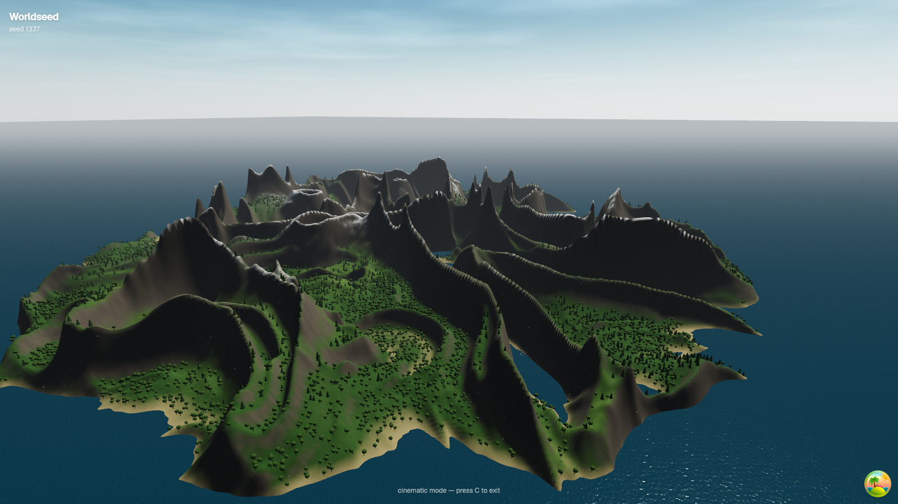
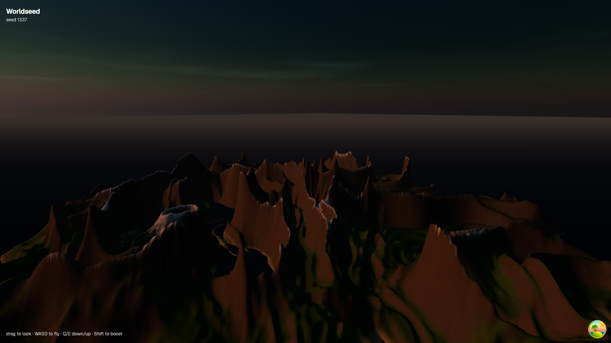
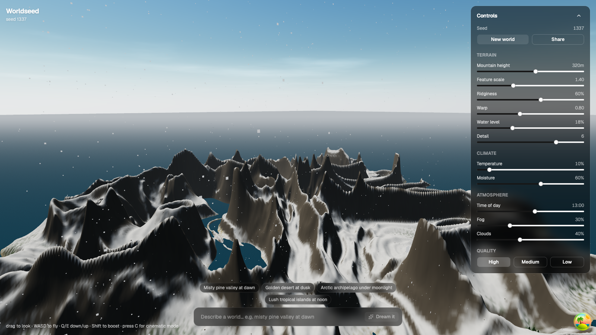
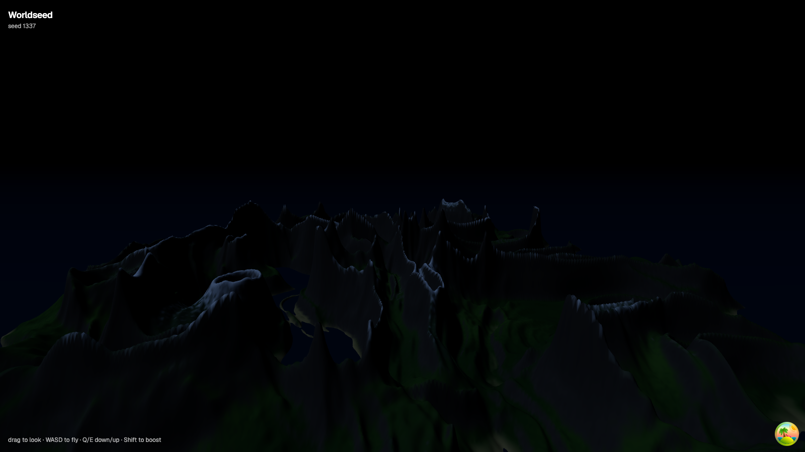

<div align="center">


# Worldseed

**Describe a world in plain English. Watch it form.**

[](https://www.typescriptlang.org)
[](https://threejs.org)
[](https://react.dev)
[](https://openai.com)
[](https://aws.amazon.com/lambda)
[](https://vitejs.dev)

**[🌍 Live Demo](https://fable-3dworld.vercel.app/)** &nbsp;·&nbsp; `?seed=1337` for a deterministic world

</div>

---

Worldseed is a procedurally generated 3D world that runs entirely in your browser. Every mountain, tree, ripple, and cloud is generated by code from a single seed — no 3D assets, no textures, no models. Type *"misty pine valley at dawn"* and an LLM translates it into engine parameters; the world rebuilds in front of you.

---

## How It Works

```
┌──────────────────────────── Browser ──────────────────────────────┐
│                                                                   │
│  React UI  ──── WorldParams ────▶  three.js WebGPU engine         │
│  (controls, prompt bar)            (terrain · biomes · sky ·      │
│        │                            vegetation · water · wind)    │
└────────│──────────────────────────────────────────────────────────┘
         │  POST /generate {"prompt": "…"}
         ▼
  AWS Lambda ──▶ OpenAI API (strict structured outputs → validated JSON)
```

Everything hinges on one typed object — `WorldParams` (seed, terrain shape, climate, atmosphere). Sliders edit it by hand; the AI fills it from language; the URL encodes it, so **every world is a shareable link**. The LLM never touches rendering — it's a control plane over a deterministic engine, with all output schema-constrained and range-clamped.

---

## What's Generated

| System | Detail |
|---|---|
| **Terrain** | Domain-warped fBm + ridged multifractals on a 512² heightfield, radial falloff, valley-flattening curve |
| **Atmosphere** | Physical sky (Rayleigh/Mie via TSL), procedural clouds, exponential height fog, ACES tone mapping |
| **Biomes** | Whittaker model — temperature × moisture drive forest, meadow, tundra, desert, snowline |
| **Life** | Climate-placed trees, grass, wildflowers, boulders; flocking birds (boids); log cabins with glowing windows |
| **Weather** | Cold worlds get GPU snowfall; warm humid nights get fireflies and pollen |
| **Water** | Tileable ripple normal map (simplex noise on a torus), scrolled per-frame |
| **Time of day** | One `timeOfDay` number drives sun angle, sky scattering, fog color, and golden-hour grading |

---

## Screenshots

| Day | Sunset |
|---|---|
|  |  |

| Snowfall | Night |
|---|---|
|  |  |

---

## Run Locally

```bash
nvm use                       # Node 22
npm install
npm run dev                   # frontend → http://localhost:5173

# separate terminal
node lambda/dev-server.mjs    # AI API on :8787 (mock mode — free, no key needed)
```

For real AI generations:

```bash
cp lambda/.env.example lambda/.env   # add your OpenAI key
node lambda/dev-server.mjs           # prints "live mode"
```

**Controls:** drag to look · `WASD` fly · `Q/E` down/up · `Shift` boost · `C` cinematic mode

---

## AI Layer

GPT-4o mini with **strict structured outputs** → zod-validated, range-clamped `WorldParams`. The LLM is purely a control plane — it never touches the renderer. Free mock mode ships out of the box for local development with no API key required.

---

## Stack

`TypeScript (strict)` `three.js WebGPURenderer + TSL` `React 19` `Tailwind v4` `shadcn/ui` `TanStack Query` `zod` `Vite` `AWS Lambda` `OpenAI API`

---

## Built with AI, Deliberately

Built in collaboration with Claude using a lead/implementer agent workflow — a lead session owned architecture, specs, and code review; Sonnet subagents implemented well-specified phases and were reviewed before merge. The commit history documents the split.

---

## Deploying to AWS

See [`lambda/README.md`](./lambda/README.md) for full Lambda deployment instructions.
